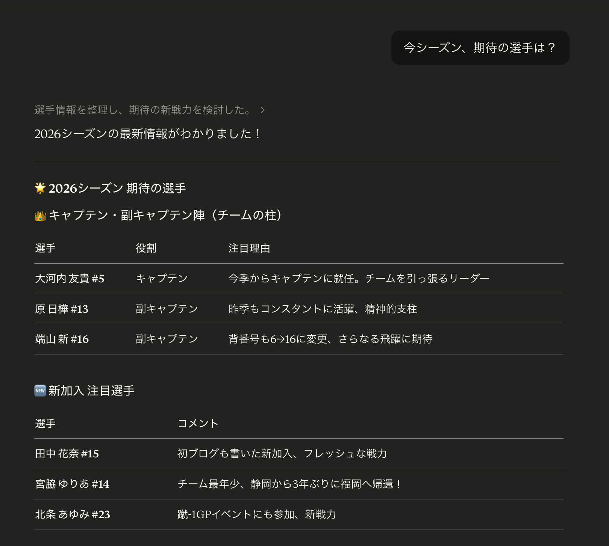

# anclas-mcp-server

福岡J・アンクラス公式サイト (https://anclas.jp/) のMCPサーバー。
WordPress REST APIから試合情報・ニュース・選手ブログを取得できる。

## こんなことができます

Claude Desktopで普通に話しかけるだけで、アンクラスの情報を取得できます。



```
あなた: 「アンクラスの次の試合いつ？」
Claude: 4月12日(日) 12:00、Qリーグ開幕戦 vs ヴィアマテラス宮﨑Alegrita、
        会場は宇美町総合スポーツ公園です。

あなた: 「去年のシーズン成績は？」
Claude: 2025シーズンは15勝1分3敗（勝点46）、得点41・失点10で優勝しました。

あなた: 「平良文果のブログ読みたい」
Claude: 最新記事「〇〇〇」（2025-10-20）...

あなた: 「ユニフォームの情報ある？」
Claude: 「2026シーズン ユニフォームデザイン決定のお知らせ」が見つかりました。
        40年の歴史への敬意を込めた復刻デザインで...
```

## ツール一覧

| ツール | 説明 |
|---|---|
| `get_next_match` | 次の試合情報（日時・対戦相手・会場） |
| `get_recent_matches` | 直近の試合結果（スコア・得点者） |
| `get_season_results` | シーズン成績サマリー（勝敗・得失点） |
| `get_player_blog` | 選手ブログ記事の取得 |
| `get_players` | 選手一覧 |
| `get_latest_news` | 最新クラブニュース |
| `search_articles` | フリーワード記事検索 |

## インストール

### Claude Code

```bash
claude mcp add anclas -- npx anclas-mcp-server
```

### Claude Desktop

設定ファイルに追加してClaude Desktopを再起動してください。

| OS | 設定ファイルのパス |
|---|---|
| Mac | `~/Library/Application Support/Claude/claude_desktop_config.json` |
| Windows | `%APPDATA%\Claude\claude_desktop_config.json` |

```json
{
  "mcpServers": {
    "anclas": {
      "command": "npx",
      "args": ["anclas-mcp-server"]
    }
  }
}
```

再起動後、入力欄の `+` ボタン → 「コネクタ」を開くと `anclas` が表示されます。

### 話しかける

「アンクラスの次の試合いつ？」と聞いてみてください。

## データソース

anclas.jp の WordPress REST API（認証不要・無料）からデータを取得しています。
試合カテゴリは起動時に自動検出されるため、新シーズンのカテゴリが追加されても
コード変更は不要です（MCPサーバーの再起動のみ必要）。
